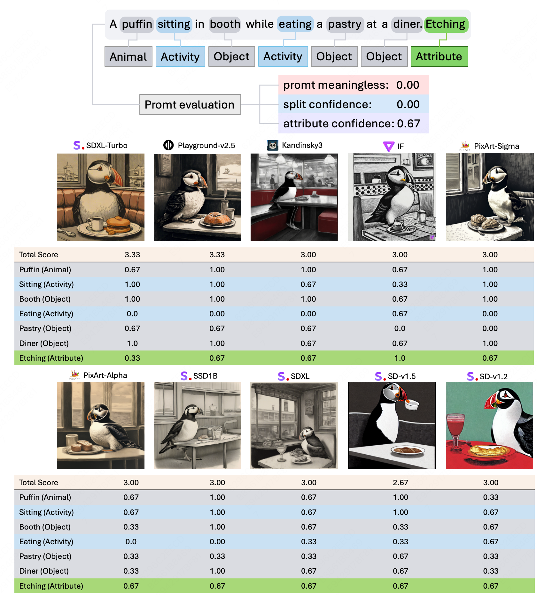
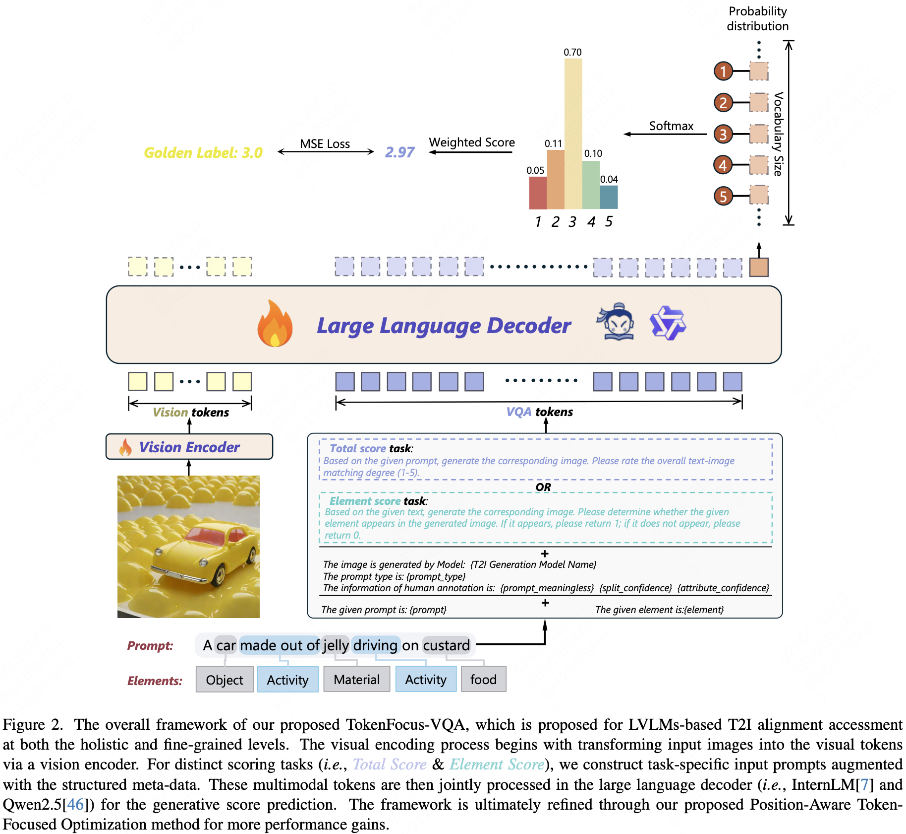
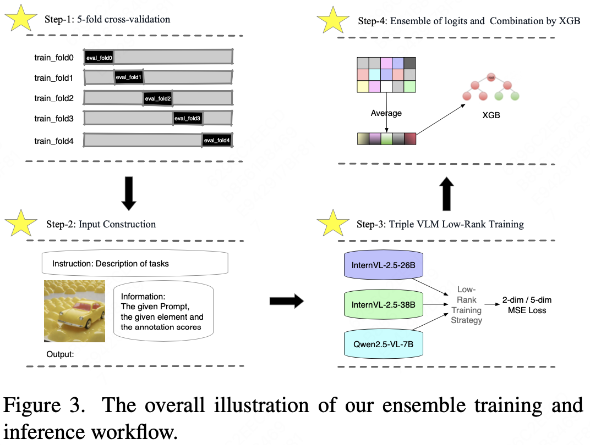

# TokenFocus-VQA: Enhancing Text-to-Image Alignment with Position-Aware Focus and Multi-Perspective Aggregations on LVLMs
## Abstruct
While text-to-image (T2I) generation models have achieved remarkable progress in recent years, existing evaluation methodologies for vision-language alignment still struggle with the fine-grained semantic matching. Current approaches based on global similarity metrics often overlook critical token-level correspondences between textual descriptions and visual content. To this end, we present TokenFocus-VQA, a novel evaluation framework that leverages Large Vision-Language Models (LVLMs) through visual question answering (VQA) paradigm with position-specific probability optimization. Our key innovation lies in designing a token-aware loss function that selectively focuses on probability distributions at pre-defined vocabulary positions corresponding to crucial semantic elements, enabling precise measurement of fine-grained semantical alignment. The proposed framework further integrates ensemble learning techniques to aggregate multi-perspective assessments from diverse LVLMs architectures, thereby achieving further performance enhancement. Evaluated on the NTIRE 2025 T2I Quality Assessment Challenge Track 1, our TokenFocus-VQA ranks 2nd place (0.8445, only 0.0001 lower than the 1st method) on public evaluation and 2nd place (0.8426) on the official private test sets, demonstrating superiority in capturing nuanced text-image correspondences compared to conventional evaluation methods.

## Introduction
- **Token-Focus Supervised & Position-Specific Loss**  
  We introduce a novel loss function combining **T**oken-**F**ocus supervision and **P**osition-**S**pecific optimization to enhance LVLMs fine-tuning, achieving significant improvements in fine-grained image-text matching.

- **Multi-Perspective Ensemble Framework**  
  We propose an optimized ensemble framework integrating Bagging, Stacking, and Blending strategies to overcome single LVLM limitations in multimodal evaluation through multi-perspective aggregation.

- **State-of-the-Art Performance**  
  Extensive experiments demonstrate the effectiveness of TokenFocus-VQA, showing superior performance on both the EvalMuse-40K benchmark and NTIRE 2025 competition testbed.
  

## Methodology
The TokenFocus-VQA system extends the standard Visual Question Answering (VQA) paradigm with these innovations:

### Key Components
1. **Multimodal Encoding**  
   - Processes both visual inputs (images) and structured queries through pre-trained LVLMs
   - Generates aligned visual-textual token representations

2. **Token-Focus Generation**  
   - Implements **first-token emphasis** strategy during answer generation
   - Enforces strict output formatting controls
   - Focuses prediction energy on initial response tokens

3. **Hybrid Loss Calculation**  
   - Combines language modeling with numerical regression objectives
   - Aligns label prediction dimensions across modalities
     
4. **Multi-Model Integration**
   - Implements bootstrap aggregating across multiple LVLM instances
   - Combins stacking and bagging via meta-learner integration

